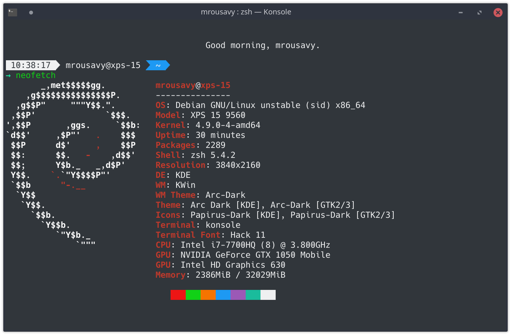
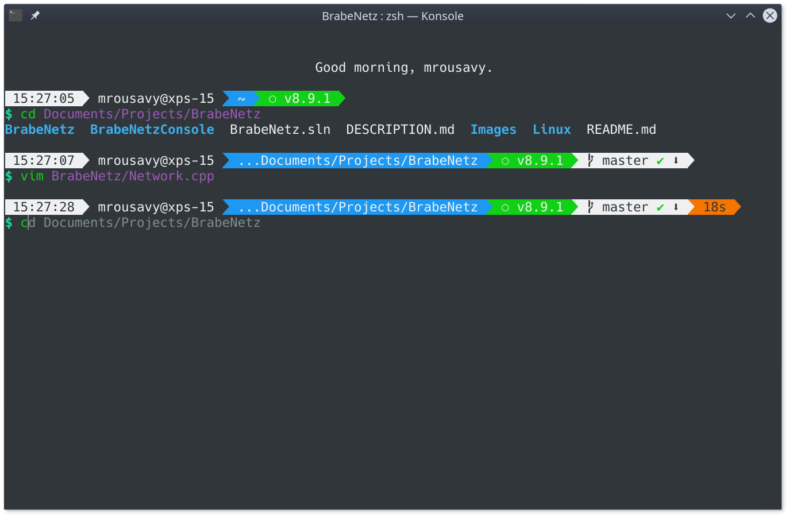
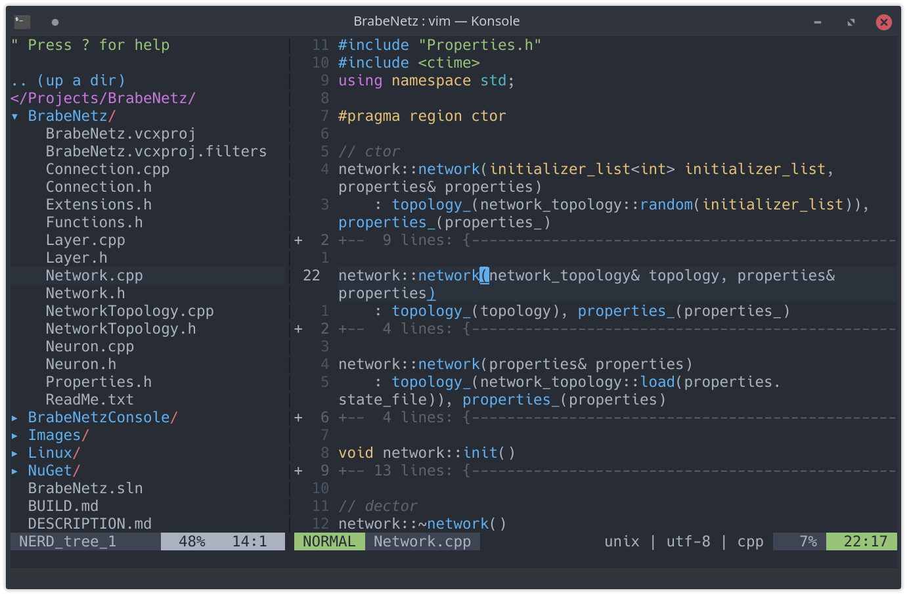

## My personal minimalistic dotfiles

The install script will only work if you have **zsh** installed & initialized, and **KDE Konsole** installed.

For Zsh/Console there are two settings:

* When the environment variable `$MINIMAL_THEME` is set, the input prompt line does **only show directory and status**
* When the environment variable `$LIGHT_THEME` is set, the terminal's **input prompt line** is adjusted for a **white background terminal** and vim uses **One-Light** theme instead of **One-Dark**.

<a href='https://ko-fi.com/F1F8CLXG' target='_blank'></a>

### Install

First you'll need zsh and vim:

```sh
sudo apt update && sudo apt install zsh vim && zsh
```

Download and run the install script:

```sh
git clone http://github.com/mrousavy/dotfiles
cd dotfiles
./install.sh
```

### Screenshots








### Contents

* KDE Konsole profile and config (theme, ..)
* KDE KWin settings (key shortcuts, look, theme, ..)
* Required packages (`wmctrl`, `git`, `build-essential`, `cmake`, `python`)
* Zsh configuration (`~/.zshrc`)
* Vim configuration (`~/.vimrc`)
* Oh-My-Zsh custom key-bindings (`~/.oh-my-zsh/custom/keys.sh`)
* Oh-My-Zsh custom greeting script (`~/.oh-my-zsh/custom/greet.sh`)
* Zsh-Theme (`~/.oh-my-zsh/themes`)
* Xorg Clipboard: `xcpaste`: `paste` and `xccopy`: `copy` commands
